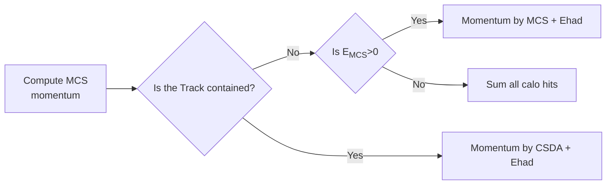

```mermaid
flowchart LR
    A["Compute MCS
     momentum"]
    A --> C{Is the Track contained?}
    C -->|No| D{Is E<sub>MCS</sub>>0}
    C --->|Yes| E[Momentum by CSDA + Ehad]
    D --> |Yes| Emcs[Momentum by MCS + Ehad]
    D --> |No| G[Sum all calo hits]
```

    