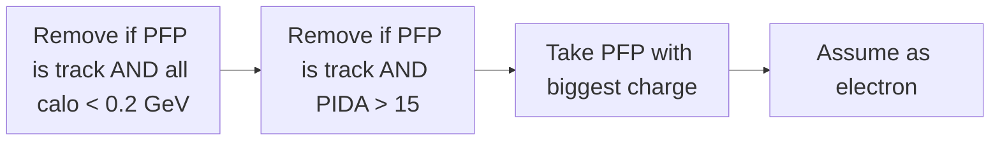

```mermaid
%%{init: {'themeVariables': { 'fontSize': '28px'}}}%%
flowchart LR
R1["Remove if PFP is track AND all calo < 0.2 GeV"] -->
R2["Remove if PFP is track AND PIDA > 15"] -->
Q["Take PFP with biggest charge"] -->
F["Assume as electron"]

```
