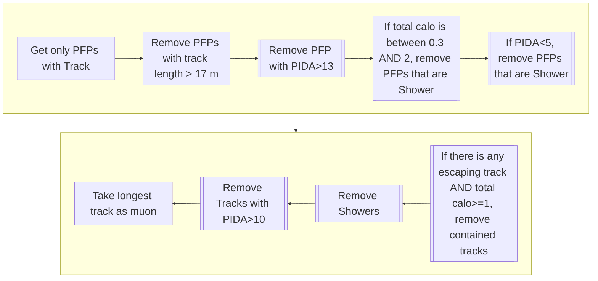

```mermaid
%%{init: {'themeVariables': { 'fontSize': '28px'}}}%%
flowchart TD
    subgraph Z[" "]
    direction LR
        PFPIsTrack[Get only PFPs with Track] -->
        A[[Remove PFPs with track length > 17 m]] -->
        B[["Remove PFP with PIDA>13"]] -->
        C[["If total calo is between 0.3 AND 2, remove PFPs that are Shower"]] -->
        D[["If PIDA<5, remove PFPs that are Shower"]]
    end

    subgraph ZA[" "]
    direction RL
        F[["If there is any escaping track AND total calo>=1, remove contained tracks"]] -->
        G[["Remove Showers"]]  -->
        H[["Remove Tracks with PIDA>10"]]  -->
        Longest["Take longest track as muon"]
    end

Z --> ZA

```
