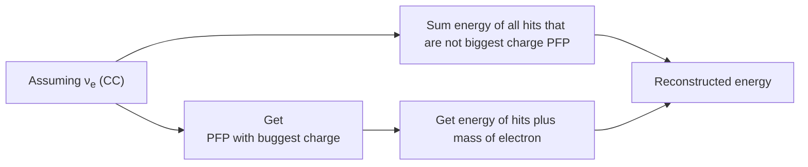

```mermaid
flowchart LR
    nuev["Assuming  ν<sub>e</sub> (CC)"]
    nuev -->A["Get
    PFP with buggest charge"] --> 
    C["Get energy of hits plus mass of electron"]
    nuev -->had["Sum energy of all hits that are not biggest charge PFP"]

    had --> F["Reconstructed energy"]
    C --> F

```
