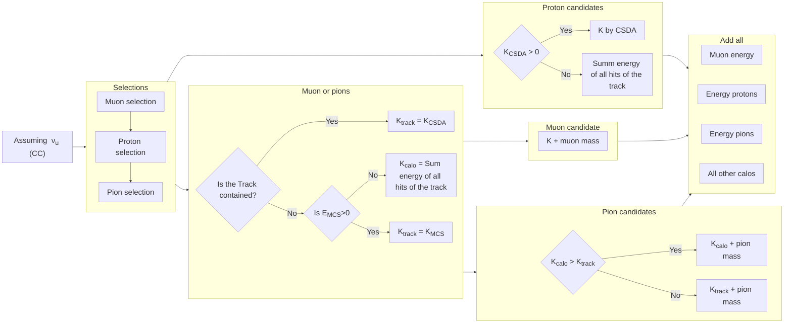

```mermaid
%%{init: {'themeVariables': { 'fontSize': '28px'}}}%%
flowchart LR
    nuev["Assuming  ν<sub>u</sub> (CC)"]
    subgraph AA["Selections"]
    direction TB
    mu["Muon selection"] -->
    pr["Proton selection"] -->
    pi["Pion selection"]
    end

    subgraph muorpiE["Muon or pions"]
    direction LR
    C2{"Is the Track contained?"}
    C2 -- Yes ---> Erange2["K<sub>track</sub> = K<sub>CSDA</sub>"]
    Emcs2["K<sub>track</sub> = K<sub>MCS</sub>"]
    C2 -- No --> D2{"Is E<sub>MCS</sub>&gt;0"} -- Yes --> Emcs2

    mucalo2["K<sub>calo</sub> = Sum energy of all hits of the track"]
    D2 -- No --> mucalo2
    end

    subgraph muE["Muon candidate"]
    direction LR
    muEz["K + muon mass"]
    end

    subgraph piE["Pion candidates"]
    direction LR
    Emcs2 ~~~ C3{"K<sub>calo</sub> &gt K<sub>track</sub>"}
    C3 -- Yes --> picalo["K<sub>calo</sub> + pion mass"]
    C3 -- No --> pitrack["K<sub>track</sub> + pion mass"]
    end

    subgraph prE["Proton candidates"]
    direction LR
    Cpr{"K<sub>CSDA</sub> &gt 0"} -- Yes -->
    Kpr["K by CSDA"]
    Cpr -- No --> Kpr2["Summ energy of all hits of the track"]
    end


    muorpiE --> muE
    muorpiE --> piE

    nuev -->AA
    AA --> prE
    AA --> muorpiE
    
    subgraph all["Add all"]
    direction TB
    aZ["Muon energy"] ~~~
    bZ["Energy protons"] ~~~
    cZ["Energy pions"] ~~~
    dZ["All other calos"]
    end
    prE --> all
    muE --> all
    piE --> all

```
