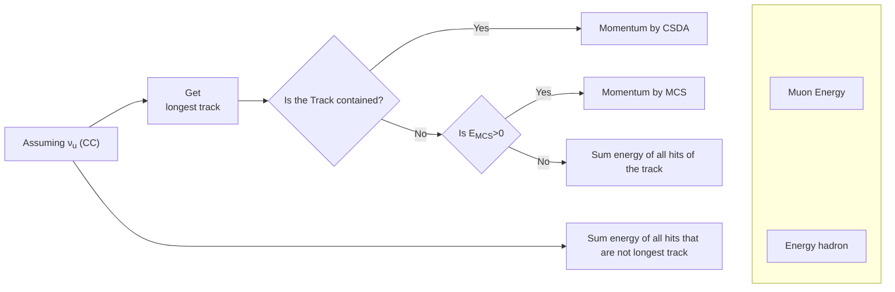

```mermaid
flowchart LR
    nuev["Assuming  ν<sub>u</sub> (CC)"]
    nuev -->A["Get
    longest track"] --> C{"Is the Track contained?"}
    C -- No --> D{"Is E<sub>MCS</sub>&gt;0"}
    C -- Yes ---> Erange["Momentum by CSDA"]
    D -- Yes --> Emcs["Momentum by MCS"]
    D -- No --> mucalo["Sum energy of all hits of the track"]
    nuev -->had["Sum energy of all hits that are not longest track"]
    Erange ~~~ Emu["Muon Energy"]
    Emcs ~~~ Emu
    mucalo ~~~ Emu
    had ~~~ Ehad["Energy hadron"]
    subgraph AA[" "]
    Emu 
    Ehad
    end

```
