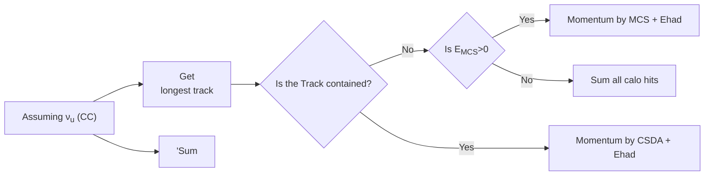

```mermaid
flowchart LR
    nuev["Assuming  ν<sub>u</sub> (CC)"]
    nuev -->A["Get
    longest track"] --> C{"Is the Track contained?"}
    C -- No --> D{"Is E<sub>MCS</sub>&gt;0"}
    C -- Yes ---> E["Momentum by CSDA + Ehad"]
    D -- Yes --> Emcs["Momentum by MCS + Ehad"]
    D -- No --> G["Sum all calo hits"]
    nuev -->had['Sum]
```
