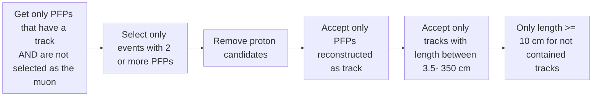

```mermaid
%%{init: {'themeVariables': { 'fontSize': '28px'}}}%%
flowchart LR

Clean["Get only PFPs that have a track
AND are not selected as the muon"] -->

R1["Select only events with 2 or more PFPs"] -->
R2["Remove proton candidates"] -->
R3["Accept only PFPs reconstructed as track"] -->
R4["Accept only tracks with length between 3.5- 350 cm"] -->
R5["Only length >= 10 cm for not contained tracks"] 

```
