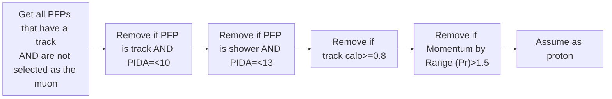

```mermaid
%%{init: {'themeVariables': { 'fontSize': '28px'}}}%%
flowchart LR

Clean["Get all PFPs that have a track
AND are not selected as the muon"] -->

R1["Remove if PFP is track AND PIDA=<10"] -->
R2["Remove if PFP is shower AND PIDA=<13 "] -->
R3["Remove if track calo>=0.8"] -->
R4["Remove if Momentum by Range (Pr)>1.5"] --> 
F["Assume as proton"]

```
